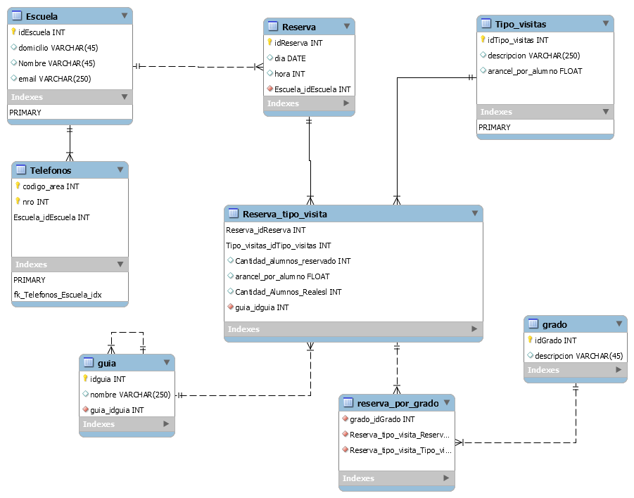

# Universidad
Programas que realicé durante mi instancia estudiando la Tecnicatura Universitaria en Programación en la UTN FRRa.

# Laboratorio IV 🎓

Este repositorio contiene ejercicios realizados de la materia Laboratorio IV de la UTN FRRa. Los ejercicios están enfocados en la creación y manipulación de bases de datos con el lenguaje SQL.

## Diagrama Utilizado

## Cómo usar este repositorio

1. Clona el repositorio en tu máquina local.
2. Sigue las instrucciones de cada ejercicio para completar las tareas.
3. Asegúrate de probar cada cambio en tu base de datos para verificar que se ha realizado correctamente.

## Contribuciones

Si deseas contribuir a este repositorio, por favor, abre un issue o envía un pull request con tus cambios.
